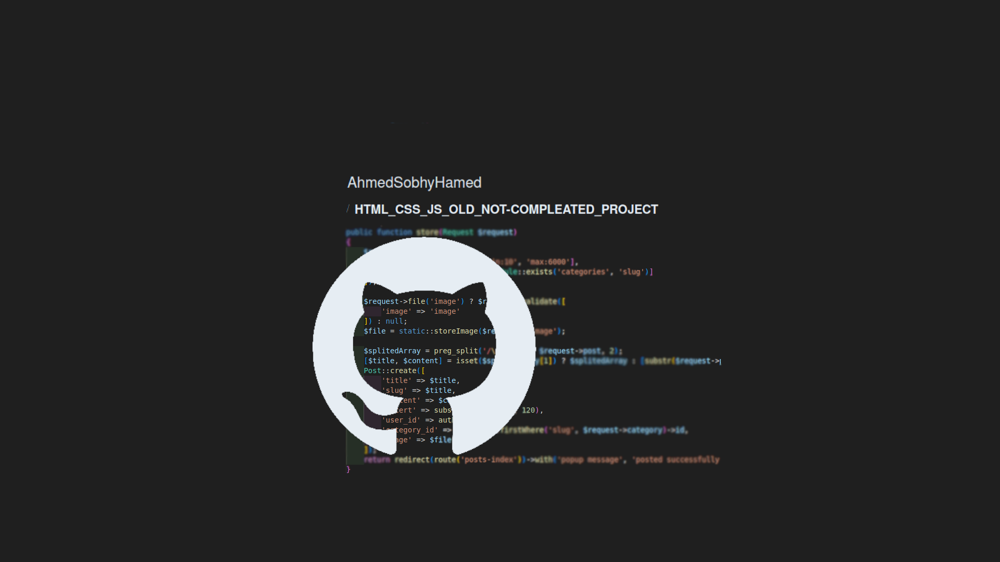

# Bootstrap_ACC_Project

A small Bootstrap-based project using HTML, CSS, Bootstrap, and JavaScript to recombine separate sections into a single page.


## Table of Contents

- [Introduction](#introduction)
- [Features](#features)
- [Installation](#installation)
- [Usage](#usage)
- [Technologies Used](#technologies-used)
- [Project Structure](#project-structure)
- [License](#license)
- [Contact](#contact)

  <!-- intro -->

## Introduction

This project is my first use of Bootstrap. It is the final project for ACC's 'Web Development Workshop.
<br>
This project combines three free W3Schools templates (Band, Company, and Who Am I), with sections from each template added and slightly edited in one file.
<br>
For this project, I customized some CSS styles and wrote some JavaScript scripts.

  <!-- technologies was used with links if available -->

## Features

- Using bootstrap 3.
- Reusing templates to create a custom page.
- Use the Bootstrap navbar component.
  <br>
  Example:

  ```html
  <nav class="navbar navbar-default navbar-fixed-top">
    <div class="container-fluid">
      <div class="navbar-header">...</div>
      <div class="collapse navbar-collapse" id="myNavbar">
        <ul class="nav navbar-nav navbar-right">
          ...
        </ul>
      </div>
    </div>
  </nav>
  ```

- Use the Bootstrap carousel component.
  <br>
  Example:

  ```html
  <div id="myCarousel" class="carousel slide" data-ride="carousel">
    <ol class="carousel-indicators"></ol>
    <div class="carousel-inner" role="listbox">
      <div class="item active"></div>
    </div>
    <a
      class="left carousel-control"
      href="#myCarousel2"
      role="button"
      data-slide="prev"
    ></a>
    <a
      class="right carousel-control"
      href="#myCarousel2"
      role="button"
      data-slide="next"
    ></a>
  </div>
  ```

- Use the Bootstrap grid system.
  <br>
  Example:

  ```html
  <div id="about" class="container-fluid slideanim bg-grey">
    <div class="row">
      <div class="col-sm-6"></div>
    </div>
  </div>
  ```

  <!-- usage or how to interact with this technologies like api end points and what they do -->

## Usage

**You can interact with the project via this link**
[web page on github]().
<br>
**[see an example for user interaction.[video]](https://youtube.com)**
<br>
**[demonstration video for developer communit](https://www.youtube.com)**

## Technologies Used

- HTML 5.
- CSS.
- Bootstrap 3.
- Vanilla JS.
- Jquery.

  <!-- about the project and a digram of how it work -->

## Project Structure

- Project page:
  - index.html
- Tamplates that used:
  - resources/templates/\*.html
    <!-- licance -->

## License

This project is licensed under the MIT License - see the [LICENSE](/LICENSE) file for details

  <!-- contacts -->

## Contact

Created by [Ahmed Sobhy]:

- email: [ahmed.s.abdulaal@gmail.com](mailto:ahmed.s.abdulaal@gmail.com)
- linkedin: [Ahmed Sobhy](https://www.linkedin.com/in/ahmed-sobhy-b824b7201/)
  <br>
  feel free to contact me!
